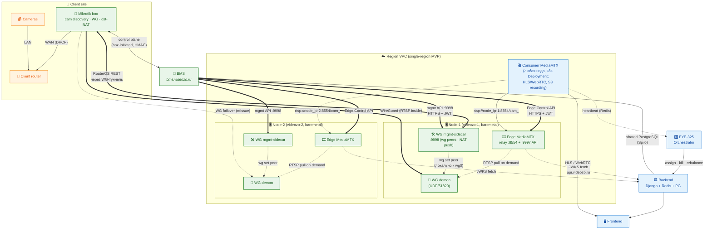

# Архитектура: edge-коробка + VPN + autodiscovery + интеграция с EYE-325

## Глоссарий

Все термины и сокращения, которые встречаются ниже. По тексту первое упоминание ведёт сюда.

### Компоненты

- **Box** / **Edge box** / **коробка** — Mikrotik-роутер на объекте клиента. Поднимает [WG](#t-wg)-туннель наружу, делает [discovery](#t-disc) камер, [dst-NAT](#t-dstnat) запросов из VPN на реальные IP камер.
- **BMS** *(Box Management Service)* — наш новый control plane для коробок: bootstrap, выдача WG-конфига, ingestion discovery, heartbeat, push конфигов. **Отдельный compose-сервис** (а не часть основного backend), использует тот же `${BACKEND_IMAGE}` (паттерн `watcher_motion_analyzer`), запускает uvicorn с собственным `ROOT_URLCONF=videozo.bms_urls` и Traefik label на `[bms.videozo.ru](#t-static)` / `bms.dev.videozo.ru`. Кодовая база — Django app `bms/` внутри основного backend-репо.
- **Node** / **Baremetal-node** — физическая машина под Docker (сегодня — videozo-1 prod, videozo-2 dev) или k8s-node в будущем. На ней крутятся контейнеры [WG Concentrator](#t-cv) и/или [MediaMTX](#t-mtx). Все ноды региона объединены в общую [VPC](#t-vpc) и L3-связны между собой по `node_ip`.
- **WG Concentrator** — bundle на [baremetal-ноде](#t-node) из трёх контейнеров **в общей network namespace**: WG-демон (`lscr.io/linuxserver/wireguard`, терминирует WG-туннели коробок), [Edge MediaMTX](#t-edge-mtx) в роли RTSP-relay и [WG mgmt-sidecar](#t-wgmgmt) для control-операций изнутри WG-туннеля. На сегодня — docker compose stack с `network_mode: "service:wireguard"` для Edge MediaMTX и mgmt-sidecar; в будущем — k8s **DaemonSet с node affinity** (один Pod из трёх контейнеров с общей netns на каждую WG-помеченную ноду). Каждый концентратор имеет собственный публичный UDP-endpoint для WG; `ip_forward=1` на host **не требуется** (все процессы в одной netns с `wg0`).
- **Edge MediaMTX** — отдельный экземпляр `bluenviron/mediamtx` на [WG-концентраторе](#t-cv) в роли **RTSP-relay**. Слушает RTSP на `:8554` и Control API на `:9997`. На каждую активную камеру [BMS](#t-bms) через [Control API](#t-edge-api) добавляет path `cam_<camera_id>`, у которого `source: rtsp://<wg_virtual_ip>:554/<rtsp_path>` + `sourceOnDemand: yes` + `sourceOnDemandCloseAfter: 30s`. [Consumer MediaMTX](#t-cons-mtx) с любой ноды коннектится к `rtsp://<node_ip WG-ноды>:8554/cam_<camera_id>`. Один порт `:8554` на ноду, path-based routing для всех камер концентратора. Recording в S3 и HLS/WebRTC раздача на этом инстансе **не делаются** — он чистый relay.
- **Edge Control API** — REST-API [Edge MediaMTX](#t-edge-mtx) на `:9997` (`POST/PATCH/DELETE /v3/config/paths/<name>`, `GET /v3/paths/list`). Auth — JWT через наш Backend (см. [EYE-359 service-token](https://youtrack.fabrique.studio/issue/EYE-359), тот же стек, что для consumer mediamtx). [BMS](#t-bms) получает service-token и им управляет relay-paths.
- **WG mgmt-sidecar** — третий контейнер в bundle [WG-концентратора](#t-cv), в той же netns, что WG-демон и [Edge MediaMTX](#t-edge-mtx). Лёгкий HTTP-сервис (FastAPI/Uvicorn) на `:9998`, биндится на private 10.20.0.x. Принимает от [BMS](#t-bms) запросы, требующие доступа изнутри WG-туннеля или к самому `wg0`: (1) `wg set peer add/remove` через `wg-tools` на локальном `wg0` (+ `wg syncconf` для persistence в `/config/wg_confs/wg0.conf`); (2) проксирование RouterOS REST-вызовов в Mikrotik (`POST /mikrotik/{box_id}/rest/...`) — sidecar коннектится к `https://<box.wg_peer_ip>/rest/...` через `wg0` (target IP передаётся **explicit в body** запроса от BMS, sidecar stateless без кэша box→peer_ip). Контейнер требует `cap_add: [NET_ADMIN]` для `wg set` (шаринг netns ≠ шаринг capabilities). Auth — JWT через тот же service-token issuer, что и [Edge Control API](#t-edge-api) (см. [EYE-359](https://youtrack.fabrique.studio/issue/EYE-359)), claim `wg_mgmt: true` для scope-различения от `mediamtx_permissions`. Решает разрыв «BMS живёт в bridge-network и физически не видит `100.64.0.0/10`».
- **Consumer MediaMTX** — существующий медиасервер проекта (`app/backend/.../mediamtx`): pull RTSP **из Edge MediaMTX** (`rtsp://<node_ip>:8554/cam_<id>`), HLS/WebRTC раздача клиентам через [Traefik](#t-traefik), запись в [S3](#t-s3). На сегодня — Docker-контейнеры на [baremetal-нодах](#t-node) в обычной bridge-network; в будущем — k8s **Deployment** (реплики на любых нодах, без host-network/CAP_NET_ADMIN). Между Edge и Consumer работает **fan-out dedup** mediamtx — один upstream-pull на N consumer-узлов.
- **Discovery** — обнаружение камер в LAN клиента: ARP-scan + [ONVIF](#t-onvif) unicast Probe. **Делается на самой [Box](#t-box)** (это L2-операции, ни [BMS](#t-bms), ни нода с [WG-концентратором](#t-cv) не на той L2). Box постит результаты в BMS по REST.
- **MediaMTX** — общий термин. В нашей архитектуре в двух ролях: [Edge MediaMTX](#t-edge-mtx) (relay на WG-ноде) и [Consumer MediaMTX](#t-cons-mtx) (раздача клиентам и запись). См. их отдельные термины выше.
- **Orchestrator** ([EYE-325](https://youtrack.fabrique.studio/issue/EYE-325)) — management-команда Django, раскладывает камеры по живым узлам [MediaMTX](#t-mtx), детектит падения, ребалансирует.
- **Backend** — существующий Django-проект (модели Camera/Place/Box, REST, JWT, админка).
- **Client router** — роутер клиента, к которому физически подключены камеры и наша [Box](#t-box) (через WAN-порт по DHCP).
- **Static domain** — `bms.videozo.ru`, единственный хардкод в прошивке коробки. CNAME на [BMS](#t-bms) за Traefik.

### Сетевые термины

- **VPN** — Virtual Private Network. В нашей архитектуре реализуется через [WG](#t-wg).
- **L2** — Layer 2 (канальный уровень OSI, Ethernet). [ARP](#t-arp) и [ONVIF](#t-onvif) Probe — L2-операции, не маршрутизируются через [WG](#t-wg) (он L3).
- **WG** / **WireGuard** — [VPN](#t-vpn)-протокол поверх UDP. Outbound от клиента, UDP/51820 (fallback 443).
- **RTSP** — протокол видеопотока с IP-камер; идёт внутри [WG](#t-wg)-туннеля.
- **HLS** — HTTP Live Streaming, отдача видео в браузер через HTTP.
- **WebRTC** — low-latency видео в браузер.
- **ONVIF** — стандарт обнаружения IP-камер (UDP/3702, unicast Probe).
- **dst-NAT** — destination NAT на [Box](#t-box): переводит запросы из WG-virtual подсети в реальные LAN-IP камер по [MAC](#t-mac).
- **MAC-as-id** — идентификатор камеры в нашей модели — её MAC-адрес, а не IP. Устойчив к DHCP-renumbering у клиента.
- **CGNAT** / `100.64.0.0/10` — Carrier-Grade NAT диапазон. Используем под WG-virtual подсети, чтобы не конфликтовать с подсетями клиентов.
- **HMAC-secret** — 32-байтный симметричный ключ, зашитый на коробку при сборке партии. Подписывает каждый запрос **коробки** в [BMS](#t-bms): `X-Box-Auth: HMAC-SHA256(box_secret, serial + timestamp + body)`. BMS хранит `Box.hmac_secret` (encrypted at rest). Защищает от подмены serial. Применяется **только** для аутентификации Mikrotik→BMS (через WAN — `bootstrap`, `discovery`, `heartbeat`, `wg/reissue`). Все интра-VPC связи (BMS↔Edge MediaMTX, BMS↔mgmt-sidecar, Edge↔BMS restart-webhook) используют JWT через [EYE-359](https://youtrack.fabrique.studio/issue/EYE-359) service-token stack.

### Инфраструктура

- **RouterOS** — операционная система Mikrotik. На наших [Box](#t-box) v7+ (нужна для [WG](#t-wg)).
- **S3-совместимое хранилище** — объектное хранилище для видеозаписей. Сюда [MediaMTX](#t-mtx) пишет файлы (через rclone), путь = `[{path_name_mediamtx}/YYYY/MM/DD/HH:MM:SS.mp4](#t-pn)`. Не зависит от конкретного [MediaMTX](#t-mtx)-узла, поэтому переезд камеры между узлами бесшовен.
- **Traefik** — reverse-proxy перед нашими сервисами. Терминирует TLS, маршрутизирует по hostname.

### Поля и состояния моделей

- `**path_name_mediamtx`** — UUID, уникальный path камеры в [MediaMTX](#t-mtx). Также префикс в [S3-хранилище](#t-s3) для записей.
- `**mediamtx_node_id**` — на каком [Consumer MediaMTX](#t-cons-mtx)-узле сейчас живёт камера. Управляет [Orchestrator](#t-orch). Edge MediaMTX в EYE-325 pool не участвует — он всегда co-located с WG на той же ноде.
- `**concentrator_id**` — id [WG-концентратора](#t-cv); поле в heartbeat **Consumer MediaMTX-узла** (не Edge — Edge не публикует heartbeat в EYE-325 pool). Заполняется, когда Consumer MediaMTX co-located с WG-Pod'ом на одной ноде (k8s nodeAffinity / docker compose на той же машине). Используется [Orchestrator](#t-orch) для soft-preference (locality bonus, см. §7), не как фильтр. Если Consumer-узел на ноде без WG — поле NULL и работает только min-load (см. §7).
- `**wg_virtual_ip**` — IP **камеры** в [WG](#t-wg)-туннеле, выделяемый из подсети коробки (`box.wg_subnet`); allocate-once на пару `(box, mac)`. Используется как `source` в path [Edge MediaMTX](#t-edge-mtx) и как `dst-address` в [dst-NAT](#t-dstnat) правиле на коробке. **Не путать с `box.wg_peer_ip`** (адрес самого WG-пира коробки, см. ниже).
- `**wg_peer_ip**` — IP **коробки** (WG-пира) в WG-туннеле, gateway-адрес её `wg_subnet`. Используется sidecar'ом как target для RouterOS REST (`https://<box.wg_peer_ip>/rest/...`). Отличается от `wg_virtual_ip`, который выделяется конкретным камерам внутри той же подсети.
- `**relay_path_name**` — имя path на [Edge MediaMTX](#t-edge-mtx); детерминированно из camera_id: `cam_<camera_id>`. Уникален в пределах одного концентратора.
- `**stream_source_link**` — RTSP-URL источника для [Consumer MediaMTX](#t-cons-mtx), computed: `rtsp://<WGConcentrator.node_ip>:8554/<relay_path_name>`. Порт `:8554` — фиксированный (Edge MediaMTX RTSP listener).

### Прочие сокращения


| Сокр.      | Расшифровка                                            |
| ---------- | ------------------------------------------------------ |
| ADR        | Architecture Decision Record                           |
| API        | Application Programming Interface                      |
| ARP        | Address Resolution Protocol                            |
| BW         | Bandwidth (пропускная способность канала)              |
| CIDR       | запись подсети вида `10.0.0.0/24`                      |
| DHCP       | Dynamic Host Configuration Protocol                    |
| FK         | Foreign Key (внешний ключ в БД)                        |
| JWT / JWKS | JSON Web Token / JSON Web Key Set                      |
| LAN / WAN  | локальная сеть / внешняя сеть коробки                  |
| MR         | Merge Request (GitLab)                                 |
| OOM        | Out-of-memory (краш по нехватке RAM)                   |
| PoE        | Power over Ethernet                                    |
| QR         | QR-код                                                 |
| SLA        | Service Level Agreement (целевое время восстановления) |
| SSE        | Server-Sent Events                                     |
| TTL        | Time-To-Live (для Redis-ключей и WG handshake)         |
| UUID       | Universally Unique Identifier                          |
| VM         | Virtual Machine                                        |
| VPC        | Virtual Private Cloud                                  |
| WS         | WebSocket                                              |
| YC         | Yandex Cloud                                           |


---

## 0. Hardware reality check (важно до старта)

**Mikrotik RB941-2nD-TC (hAP lite) — это нижняя граница, и она опасна** для нашего профиля нагрузки:


| Параметр | RB941-2nD-TC           | Что нужно для нашего сценария           |
| -------- | ---------------------- | --------------------------------------- |
| CPU      | MIPSBE 650 MHz, 1 core | ARM ≥1 GHz, 2 cores (для WG крипто)     |
| RAM      | 32 MB                  | ≥128 MB (RouterOS + WG state + scripts) |


**Два операционных риска:**

- **RAM 32 MB** — [RouterOS](#t-routeros) вместе с [WG](#t-wg)-state и нашими скриптами держится впритык. Один OOM-краш в поле = выезд монтажника. На 10+ коробках это становится регулярной статьёй расходов.
- **MIPSBE single-core** — [WireGuard](#t-wg) в [RouterOS](#t-routeros) считается на CPU; на этой архитектуре нет hardware-acceleration, поэтому крипто упирается в одно ядро 650 MHz.

---

## 1. Карта компонентов




**Легенда:** 🟢 новые компоненты, 🔵 существующее/[EYE-325](#t-orch), 🟠 клиентское оборудование. [Discovery](#t-disc) работает только на коробке. Детали — в §2 и §5.

**Архитектурное решение:** [WG-концентратор](#t-cv) на каждой [baremetal-ноде](#t-node) — это тройка контейнеров в общей netns: WG-демон (терминирует туннели коробок), [Edge MediaMTX](#t-edge-mtx) (RTSP-relay) и [WG mgmt-sidecar](#t-wgmgmt) (control-плоскость изнутри WG: `wg set peer` локально + проксирование RouterOS REST в Mikrotik через `wg0`). Per-camera path `cam_<id>` на Edge MediaMTX делает `source: rtsp://<camera.wg_virtual_ip>:554/...` через локальный `wg0` (с `sourceOnDemand: yes` + `sourceOnDemandCloseAfter: 30s` — pull только когда подписан хотя бы один Consumer MediaMTX, плюс 30 сек holding для плавных rebalance). [Consumer MediaMTX](#t-cons-mtx) живёт на **любой** ноде региона, делает обычный RTSP-pull к `rtsp://<node_ip>:8554/cam_<id>` через VPC-связность — никаких host-routes к `100.64/10`, никакого host-network. [BMS](#t-bms) — **singleton** на `bms.videozo.ru` в bridge-network; управляет Edge MediaMTX через [Control API](#t-edge-api) и Mikrotik/WG-peers через [mgmt-sidecar](#t-wgmgmt) той же ноды (оба HTTPS + JWT через EYE-359, scope-claim различает endpoint'ы). YC VPC Route Table в схеме **не используется**.

- WG-туннели коробок переживают пересоздания Consumer MediaMTX-узлов — у них разные failure-domain'ы и lifecycle.
- За оркестрацию Consumer MediaMTX отвечает EYE-325; за управление WG-peers и path'ами Edge MediaMTX — [BMS](#t-bms).

---

## 2. Разделение ответственности (новая декомпозиция)


| Сервис                                         | Что делает                                                                                                                                                                | Где живёт                                                                       |
| ---------------------------------------------- | ------------------------------------------------------------------------------------------------------------------------------------------------------------------------- | ------------------------------------------------------------------------------- |
| **[Edge box** (Mikrotik)](#t-box)              | [WG](#t-wg)-клиент, ARP/[ONVIF](#t-onvif) [discovery](#t-disc), [dst-NAT](#t-dstnat) по [MAC](#t-mac), scheduler-failover                                                 | На объекте клиента                                                              |
| **[BMS** (Box Management Service)](#t-bms)     | Регистрация коробок, выдача WG-конфига, ingestion discovery, heartbeat коробок, push конфигов; **управление relay-paths на [Edge MediaMTX](#t-edge-mtx)** через [Control API](#t-edge-api) (`:9997`, JWT) и **WG-peers/Mikrotik** через [mgmt-sidecar](#t-wgmgmt) (`:9998`, JWT) — оба API доступны на private 10.20.0.x ноды, единый JWT-стек через EYE-359; пересчёт `stream_source_link` | **Отдельный compose-сервис** (singleton) на том же `${BACKEND_IMAGE}` (паттерн `watcher_motion_analyzer`), `DJANGO_SETTINGS_MODULE=videozo.bms_settings` (выставляет `ROOT_URLCONF=videozo.bms_urls`). Traefik на `[bms.videozo.ru](#t-static)` / `bms.dev.videozo.ru`. Кодовая база — Django app `bms/` внутри основного backend-репо. |
| **[WG Concentrator](#t-cv)**                   | Тройка контейнеров в общей network namespace: WG-демон (терминирует туннели, `wg0` локально в этой netns), [Edge MediaMTX](#t-edge-mtx) (RTSP-relay) и [WG mgmt-sidecar](#t-wgmgmt) (control-плоскость изнутри WG). `ip_forward=1` **не нужен**, все процессы в одной netns | На каждой WG-помеченной [ноде](#t-node) (docker compose сегодня, k8s DaemonSet потом); адресуется `node_ip` |
| **[Edge MediaMTX](#t-edge-mtx)**               | RTSP-relay. Per-camera path `cam_<id>` с `source: rtsp://<wg_virtual_ip>:554/...`, `sourceOnDemand: yes`, `sourceOnDemandCloseAfter: 30s`. Без recording и без HLS/WebRTC | Контейнер в bundle [WG-концентратора](#t-cv) |
| **[WG mgmt-sidecar](#t-wgmgmt)**               | HTTP-сервис `:9998` для BMS. Принимает: (1) `wg set peer add/remove` на локальный `wg0` (+ `wg syncconf` для persistence); (2) проксирование RouterOS REST в Mikrotik через WG-туннель (`POST /mikrotik/{box_id}/rest/...`). Stateless: `target_peer_ip` explicit в body. Auth — JWT (claim `wg_mgmt: true`) через EYE-359 service-token issuer. `cap_add: [NET_ADMIN]` | Контейнер в bundle [WG-концентратора](#t-cv), в общей netns с WG-демоном |
| **[Consumer MediaMTX](#t-cons-mtx)**           | Pull RTSP из Edge MediaMTX по `rtsp://<node_ip>:8554/cam_<id>` (обычная VPC-связность), [HLS](#t-hls)/[WebRTC](#t-webrtc) наружу, запись в [S3](#t-s3) ([EYE-325](#t-orch)) | Docker-контейнер в bridge-network на любой [ноде](#t-node); k8s Deployment без host-network/CAP_NET_ADMIN |
| **[MediaMTX Orchestrator** (EYE-325)](#t-orch) | Раскладывает камеры по живым Consumer MediaMTX-узлам всего пула (soft-preference на локальность WG, см. §7), обрабатывает падения узлов                                   | management-команда, 1 на инсталляцию                                            |
| **[Backend** (Django)](#t-be)                  | Домен Camera/Place/Box, админка, JWT для Edge/Consumer MediaMTX (service-tokens по [EYE-359](https://youtrack.fabrique.studio/issue/EYE-359)), REST API                                                                                                               | существующий                                                                    |


**Ключевой принцип:** [EYE-325](#t-orch) **не учит про [VPN](#t-vpn), про Edge MediaMTX и про routing**. Его абстракция — `mediamtx:node:{id}` в Redis для Consumer MediaMTX; узлы публикуют heartbeat одинаково, независимо от того, на какой ноде они живут. VPN, WG-peers и relay-paths на Edge MediaMTX — забота [BMS](#t-bms).

---

## 3. Модель данных (новые сущности)

```python
class Box(SoftDeleteModel):
    id: UUID                        # генерится BMS
    serial: str                     # с заводской наклейки/QR, уникальный
    hmac_secret: bytes              # Box HMAC, 32 байта, зашит при сборке; encrypted at rest
    client_id: FK(Client, nullable) # NULL пока коробка не зарегистрирована в ЛК клиентом
    state: BoxState                 # waiting_binding|active|disabled|lost
    last_seen_at: datetime          # heartbeat от коробки
    fw_version: str
    wg_concentrator_id: FK(WGConcentrator, nullable)  # текущий концентратор
    wg_peer_pubkey: str             # коробка генерит keypair при bootstrap, сюда летит pubkey
    wg_virtual_subnet: CIDR         # /29 или /28 на коробку, из 100.64.0.0/10

    @property
    def wg_peer_ip(self) -> IPv4Address:
        # Gateway-адрес box-подсети (первый usable host) — WG-туннельный
        # IP самого Mikrotik. Sidecar дёргает <wg_peer_ip>:443/rest/...
        # (см. §4.2, §8.8). Отличается от camera.wg_virtual_ip
        # (адрес КАМЕРЫ из той же подсети).
        return next(self.wg_virtual_subnet.hosts())

class WGConcentrator(SoftDeleteModel):
    id: str                         # «wg-videozo-1», стабильный id концентратора
    node_id: str                    # id ноды, на которой запущен Pod/compose stack (hostname / k8s node name)
    public_endpoint: str            # «wg-videozo-1.videozo.ru:51820» (UDP, для коробок)
    public_key: str
    node_ip: IPv4Address            # private IP ноды в YC BM subnet 10.20.0.0/24
                                    # (videozo-1=10.20.0.10, videozo-2=10.20.0.11; см. §9 «Приватная сеть»).
                                    # На этот адрес consumer mediamtx коннектится к Edge MediaMTX (:8554),
                                    # BMS — к Edge Control API (:9997) и mgmt-sidecar (:9998).
    region: str                     # для cap-aware балансировки и single-region scope
    capacity_boxes: int             # сколько боксов планируем на узел
    # Edge MediaMTX Control API + WG mgmt-sidecar — оба на private 10.20.0.x ноды,
    # один JWT-стек через EYE-359 (см. §8.4); scope-claim различает endpoint'ы.
    edge_api_url: str               # «https://<node_ip>:9997», только во VPC (private subnet);
                                    # Auth — JWT (claim mediamtx_permissions=[{"action":"api","path":""}]).
    mgmt_api_url: str               # «https://<node_ip>:9998», только во VPC; HTTP API WG mgmt-sidecar
                                    # (см. §4.2, §8.3, §8.5: wg peer add/remove + RouterOS REST push).
                                    # Auth — JWT (claim wg_mgmt: true), тот же issuer (EYE-359).

class CameraDiscovery:              # сырые находки от боксов, до подтверждения
    id, box_id, mac, ipv4_local, manufacturer, onvif_endpoint, found_at
    state: discovered|claimed|ignored

class EdgeRelayPath(SoftDeleteModel):
    id: UUID
    wg_concentrator_id: FK(WGConcentrator)
    name: str                       # «cam_<camera_id>» — детерминирован из camera_id
    camera_id: FK(PlaceCameraSchema, unique=True)  # one-to-one
    created_at: datetime
    # UNIQUE INDEX(wg_concentrator_id, name)
    # Источник истины для reconciliation Edge MediaMTX (см. §8.4).

# В существующем PlaceCameraSchema добавляем:
class PlaceCameraSchema(...):
    box_id: FK(Box, nullable)              # к какой коробке прикреплена
    mac: str                               # MAC камеры (replace IP)
    wg_virtual_ip: IPv4Address             # allocate-once на (box, mac); source в path Edge MediaMTX
    rtsp_path: str                         # путь у вендора, например «/Streaming/Channels/101»
    mediamtx_node_id: str                  # ← из EYE-325 (consumer MediaMTX node)
    # EdgeRelayPath — обратная связь one-to-one (см. выше).
    # stream_source_link становится computed:
    #   rtsp://{relay_path.wg_concentrator.node_ip}:8554/{relay_path.name}
```

**Идентификация камеры — [по MAC](#t-mac)**, не по IP (как уже зафиксировано в research log). DHCP-renumbering у клиента не ломает поток.

---

## 4. Поток: жизненный цикл коробки и камеры

### 4.1. Bootstrap коробки

**На складе (до отправки клиенту)** на коробку зашивается всё, что не зависит от конкретной инсталляции:

- `serial` — наклейка снаружи + та же строка в `/flash/serial`.
- `[HMAC-secret](#t-hmac)` — 32 байта в `/flash/box_secret` (защищённый раздел RouterOS).
- [Static domain](#t-static) `bms.videozo.ru` — единственный URL в скриптах.
- `bootstrap.rsc`, `discovery.rsc`, `health.rsc` — RouterOS-скрипты.
- **WG не настраивается** — keypair генерируется на коробке при первом boot, peer-config приходит от [BMS](#t-bms).

**При первом включении у клиента:**

```
[Mikrotik first boot]:
   1. WAN dhcp-client; ждёт интернет.
   2. RouterOS генерит WG keypair (private остаётся на коробке навсегда).
   3. POST https://bms.videozo.ru/bms/bootstrap
        headers: X-Box-Auth: HMAC-SHA256(box_secret, serial+timestamp+body)
        body: {serial, fw, hw_revision, wg_pubkey, timestamp}
   4. BMS:
        - валидирует HMAC по таблице (serial → secret);
        - upsert Box по serial:
            если новая → state=waiting_binding, client_id=NULL,
                          назначает WG-концентратор + аллокирует /29 в 100.64.0.0/10;
            если уже есть → idempotent: возвращает текущий peer-config
                            (удобно при ребуте коробки до сохранения);
        - сохраняет wg_peer_pubkey коробки;
        - **создаёт WG-peer на выбранном концентраторе**: POST https://<node_ip>:9998/wg/peer/add
            к WG mgmt-sidecar выбранной ноды (см. §8.3);
        - возвращает peer-config: {wg_endpoint, allowed_ips, virtual_subnet, persistent_keepalive}.
        - Edge MediaMTX paths на этом этапе ещё не создаются — они появляются
          per-camera при camera-claim (см. §4.2 и §8.8).
   5. Mikrotik применяет peer-config → WG-туннель поднят.
   6. Коробка готова к регистрации клиентом, discovery уже работает,
      но результаты «висят без хозяина».

[Клиент в ЛК] «Мои коробки» → «Добавить» → вводит serial:
   - BMS проверяет, что Box существует и в state=waiting_binding →
     выставляет client_id, переводит Box в active.
   - С этого момента discovery-результаты летят в ЛК клиента.
```

**Чего коробка НЕ делает:** не записывает в свою память ни client_id, ни какие-либо «персональные» данные клиента. Всё, что у неё есть после bootstrap — это пара заводских значений (`serial` + `box_secret`), сгенерённый локально WG-keypair и текущий peer-config. Принадлежность клиенту хранится только в [BMS](#t-bms).

**После bootstrap** коробка получает адрес из своего `wg_virtual_subnet` (`box.wg_peer_ip` — gateway-адрес подсети, например `100.64.0.1/32`) и становится **доступна изнутри WG-туннеля концентратора**. Сам [BMS](#t-bms) физически сидит в bridge-network и `100.64.0.0/10` не видит — поэтому все операции, требующие dial'а внутрь туннеля (push [dst-NAT](#t-dstnat) правил, [RouterOS](#t-routeros) REST вызовы, см. §4.2), BMS делегирует через REST на [WG mgmt-sidecar](#t-wgmgmt) той же ноды, что и WG-демон. Sidecar — в общей netns с WG, дёргает Mikrotik по `https://<box.wg_peer_ip>/rest/...` уже изнутри туннеля.

**Важно:** обращения коробки в BMS (`/bms/bootstrap`, `/bms/wg/reissue`, `/bms/discovered`, `/bms/heartbeat`) идут **через WAN-uplink клиента**, а **не** через WG-туннель. `bms.videozo.ru` — публичный FQDN за Traefik'ом, а `allowed-address=100.64.0.0/10` на коробке направляет в `wg0` только трафик к самой WG-подсети. Это значит, что bootstrap и reissue работают даже когда WG-туннель не поднят (что и нужно при первом подключении или после failover текущего концентратора).

> Участие нашего админа в общем случае не требуется. Админ нужен только для recovery: «потеряли коробку», «передать другому клиенту», диагностика.

**[Static domain](#t-static)**: `bms.videozo.ru` (CNAME на [BMS](#t-bms), behind [Traefik](#t-traefik)) — **единственный** хардкод в прошивке коробки. Всё остальное приходит динамически.

### 4.1б. Применение peer-config на Mikrotik (split-tunnel для камер)

WG-туннель используется только для трафика BMS↔коробка и [MediaMTX](#t-mtx)↔камеры (диапазон [`100.64.0.0/10`](#t-cgnat)). Весь интернет-трафик LAN/WiFi-клиентов коробки идёт напрямую через WAN.

```routeros
/interface/wireguard/add name=wg0 listen-port=51820 private-key="<box-priv>"
/interface/wireguard/peers/add interface=wg0 \
    public-key="<concentrator-pub>" preshared-key="<psk>" \
    endpoint-address=<concentrator-public-ip> endpoint-port=51820 \
    allowed-address=100.64.0.0/10 persistent-keepalive=25s
/ip/address/add interface=wg0 address=<box.wg_peer_ip>/<subnet_mask>

# Реверс для dst-NAT: ответы камер из LAN наружу через wg0
# должны иметь src=<box.wg_peer_ip>, иначе у камеры нет роута к 100.64/10
# и conntrack-reverse не сработает при некоторых LAN-топологиях.
# Push'ится разово при bootstrap; out-interface-list указывает на бридж LAN-портов.
/ip/firewall/nat/add chain=srcnat action=masquerade \
    src-address=100.64.0.0/10 out-interface-list=LAN \
    comment="videozo:masq:wg-to-lan"
```

[RouterOS](#t-routeros) автоматически направляет в `wg0` только пакеты с dst в `100.64.0.0/10` (`allowed-address` peer'а служит и crypto-фильтром, и источником маршрута), default остаётся через DHCP-gateway WAN.

При добавлении конкретной камеры [BMS](#t-bms) пушит в Mikrotik [dst-NAT](#t-dstnat) правило `dst=<camera.wg_virtual_ip> → реальный_LAN_IP` (см. §4.2). Расширять `allowed-address` не нужно: виртуальный IP уже внутри `100.64.0.0/10`. Общий `srcnat masquerade` из bootstrap покрывает обратный путь ответов.

**Проверка:** `/tool/traceroute 8.8.8.8 count=1` — hop 0 должен быть DHCP-gateway WAN (например, `192.168.1.1`), **не** IP концентратора. `/ping <concentrator-virtual-ip>` — отвечает через `wg0`.

### 4.1а. Reissue WG-конфига (failover initiated by box)

Если коробка детектит, что её текущий WG-туннель сдох (см. §6.2), она зовёт отдельный эндпоинт **вне тоннеля**:

```
POST https://bms.videozo.ru/bms/wg/reissue
   headers: X-Box-Auth: HMAC-SHA256(box_secret, serial+timestamp+body)
   body: {serial, current_concentrator_id, reason, timestamp}

[BMS]:
   - валидирует HMAC + что Box существует и не в state=disabled;
   - выбирает другой WGConcentrator (исключая current_concentrator_id), с capacity;
   - удаляет peer на старом концентраторе: POST https://<old_node_ip>:9998/wg/peer/remove
       к WG mgmt-sidecar (best-effort, нода может быть мертва — ошибка не блокирует);
   - создаёт peer на новом: POST https://<new_node_ip>:9998/wg/peer/add;
   - обновляет Box.wg_concentrator_id, при необходимости переаллокирует subnet;
   - **мигрирует Edge MediaMTX paths всех камер этой коробки**: для каждой
     PlaceCameraSchema с box_id = этот box — DELETE path на старом Edge
     MediaMTX (best-effort, нода может быть мертва), POST path на новом
     (через Control API), переписать EdgeRelayPath.wg_concentrator_id;
     `name` остаётся тем же (`cam_<camera_id>`), stream_source_link
     пересчитается автоматически из нового node_ip;
   - возвращает новый peer-config (тот же wg_pubkey коробки, новый endpoint).

[Mikrotik] переписывает WG peer → туннель поднят на новом концентраторе.
```

Ключевые отличия от bootstrap:

- **Bootstrap идемпотентный, но создаёт state.** Reissue требует существующего Box и **меняет** его привязку к концентратору.
- **WG-keypair коробки не меняется** — переписывается только peer-side (endpoint, allowed-ips, subnet).
- Старый peer на упавшем концентраторе освобождается явно, не по TTL.

**Применение нового peer-config на Mikrotik:**

```routeros
/interface/wireguard/peers/set [find interface=wg0] \
    endpoint-address=<new-concentrator-ip> public-key=<new-pub> preshared-key=<new-psk>
```

Это всё. Поскольку `allowed-address=100.64.0.0/10` адресует подсеть, а не конкретный концентратор, маршрут к камерам через `wg0` сохраняется автоматически. `wg_virtual_ip` коробки и [dst-NAT](#t-dstnat) правила тоже не меняются.

### 4.2. Auto-discovery камер

```
[Mikrotik scheduler discovery.rsc, период 60с]:
   1. ARP-scan локальной подсети.
   2. На каждый найденный IP — ONVIF unicast Probe (UDP/3702).
   3. Собирает {mac, ipv4_local, manufacturer, onvif_url}.
   4. POST https://bms.videozo.ru/bms/discovered
        (через WAN-uplink клиента, не через WG — bms.videozo.ru на public Traefik)
        headers: X-Box-Auth: HMAC-SHA256(box_secret, serial+timestamp+body)
        body: {serial, found: [...]}
[BMS]:
   - валидирует HMAC, резолвит box_id по serial;
   - upsert CameraDiscovery (state=discovered) по (box_id, mac).
   - WebSocket/SSE в админку → клиент видит «Найдены новые камеры».
[Клиент]:
   - В UI кликает «Подключить» → вводит ONVIF creds (hidden field).
   - Backend создаёт PlaceCameraSchema:
        mac=…, box_id=…, wg_virtual_ip=allocate(box.wg_virtual_subnet, exclude=box.wg_peer_ip),
        rtsp_path=…  (из ONVIF GetStreamUri или ручного выбора),
        mediamtx_node_id = NULL  ← EYE-325 подберёт
   - BMS делегирует push dst-NAT в Mikrotik через WG mgmt-sidecar коробки:
        POST https://<box.concentrator.node_ip>:9998/mikrotik/<box_id>/rest/ip/firewall/nat
        headers: Authorization: Bearer <service-JWT, claim wg_mgmt: true>   # EYE-359 stack
        body: {
            "target_peer_ip": "<box.wg_peer_ip>",    # sidecar stateless: target явно
            "method": "PUT",
            "json": {
                "chain": "dstnat", "action": "dst-nat", "protocol": "tcp",
                "dst-address": "<camera.wg_virtual_ip>", "dst-port": "554",
                "to-addresses": "<real_lan_ip>", "to-ports": "554",
                "comment": "videozo:cam:<camera_id>"   # маркер идемпотентности
            }
        }
        # sidecar изнутри netns wireguard:
        #   1. GET https://<target_peer_ip>/rest/ip/firewall/nat?comment=videozo:cam:<id>
        #      — если уже есть, возвращает .id и пропускает PUT (идемпотентно).
        #   2. PUT https://<target_peer_ip>/rest/ip/firewall/nat с json из body.
        # RouterOS REST: kebab-case поля, HTTPS Basic auth (per-box admin/api user).
   - BMS создаёт EdgeRelayPath (name=`cam_<camera_id>`) на WGConcentrator
     коробки и через Edge Control API добавляет path:
        POST /v3/config/paths/add/cam_<camera_id>
        { "source": "rtsp://<camera.wg_virtual_ip>:554<rtsp_path>",
          "sourceProtocol": "tcp",
          "sourceOnDemand": true,
          "sourceOnDemandCloseAfter": "30s" }
   - stream_source_link = computed:
        rtsp://<concentrator.node_ip>:8554/cam_<camera_id>
   - SyncCameraMediaMTX → EYE-325 orchestrator назначает узел Consumer
     MediaMTX → consumer pull RTSP по stream_source_link через VPC.
```

Включение/выключение камеры в UI = `is_enabled=False` → [BMS](#t-bms) снимает [dst-NAT](#t-dstnat) (DELETE через sidecar, поиск по `comment=videozo:cam:<id>`), [EYE-325](#t-orch) удаляет [path](#t-pn) на Edge MediaMTX.

---

## 5. Сетевая топология: Edge MediaMTX как relay, Consumer MediaMTX — обычные клиенты

**Решение:** на каждой [baremetal-ноде](#t-node) с [WG-концентратором](#t-cv) запущена пара контейнеров — WG-демон и [Edge MediaMTX](#t-edge-mtx) в роли RTSP-relay. Edge MediaMTX слушает RTSP на `:8554` и [Control API](#t-edge-api) на `:9997`. На каждую активную камеру [BMS](#t-bms) через Control API добавляет path `cam_<camera_id>` с `source: rtsp://<wg_virtual_ip>:554/<rtsp_path>`, `sourceOnDemand: yes`, `sourceOnDemandCloseAfter: 30s`. [Consumer MediaMTX](#t-cons-mtx) на любой ноде коннектится к `rtsp://<node_ip>:8554/cam_<id>` через обычную VPC-связность — никаких host-routes на 100.64/10, никакого host-network. **YC VPC Route Table в схеме не участвует.**

### Путь пакета RTSP-pull (consumer → камера)

```
Consumer MediaMTX (любая нода)
    │ TCP rtsp://<node_ip Node-A>:8554/cam_<id>
    ▼
Edge MediaMTX на Node-A (path "cam_<id>", source=rtsp://100.64.0.10:554/...)
    │ TCP rtsp (upstream pull, on-demand)
    │ — внутри той же netns, что и WG-демон —
    ▼
netns WG-концентратора: routing table «100.64.0.8/29 dev wg0» (от wg-quick)
    │
    ▼ WG-encrypted UDP (через etx2 хоста)
Mikrotik box: dst-NAT 100.64.0.10 → 192.168.50.42
    │
    ▼ TCP rtsp
Камера в LAN клиента
```

### Состав WG-концентратора (на каждой WG-ноде)

| Контейнер | Образ | Назначение |
|-----------|-------|------------|
| WG-демон | `lscr.io/linuxserver/wireguard` | Терминирует UDP/51820, поднимает `wg0` в своей network namespace, выставляет `100.64.x.x/29 dev wg0` |
| Edge MediaMTX | `bluenviron/mediamtx:latest` | RTSP-relay `:8554`, Control API `:9997`. Один процесс на N камер ноды, path-based routing |
| WG mgmt-sidecar | внутренний (FastAPI/uvicorn) | HTTP `:9998` для BMS: `wg set peer add/remove` локально + `wg syncconf wg0 /config/wg_confs/wg0.conf` (persistence) + проксирование RouterOS REST в Mikrotik через `wg0`. Stateless: target `wg_peer_ip` передаётся explicit в body. Auth — JWT (claim `wg_mgmt: true`) через EYE-359 service-token issuer. Требует `cap_add: [NET_ADMIN]` для `wg set` |

**Network namespace:** Edge MediaMTX и WG mgmt-sidecar **шарят netns с WG-демоном** (`network_mode: "service:wireguard"` в docker compose; в k8s — три контейнера в одном Pod, netns общая автоматически). Это даёт обоим прямую видимость `wg0` без `ip_forward=1` и без bridge/SNAT — Edge MediaMTX делает RTSP-pull к `100.64.x.x:554` (адрес камеры), mgmt-sidecar коннектится к Mikrotik по `<box.wg_peer_ip>:443` (адрес коробки в туннеле), оба пакета уходят в `wg0` без host-routing. Из netns WG-демона публикуются порты `:51820/udp` (наружу для коробок), `:8554/tcp` Edge MediaMTX, `:9997/tcp` Edge Control API и `:9998/tcp` mgmt-sidecar — три последних биндятся **только** на private subnet `10.20.0.x` (см. §9). Альтернатива через `network_mode: host` отвергнута — она экспортирует `wg0` в host-NS, что нарушает изоляцию и засоряет host routing table.

**Capabilities sidecar'а:** `network_mode: "service:wireguard"` шарит только netns, не capabilities. Чтобы вызывать `wg set wg0 peer ...` и `wg syncconf`, контейнеру нужен **`cap_add: [NET_ADMIN]`** явно. WG-демон уже имеет эту cap; sidecar добавляет её отдельно. Persistence: после каждого `wg set peer add/remove` sidecar делает `wg syncconf wg0 <(wg-quick strip wg0)` (или эквивалент) — иначе peer пропадает при рестарте контейнера wireguard.

Хранилище — volume для конфигурации:
- `/mediamtx.yml` — статика (порты, JWT-backend URL, политика auth, JWKS pinning). Read-only ConfigMap в k8s; на baremetal — bind-mount файла из репозитория. Path'ы здесь **не пишутся**.
- Все per-camera path'ы существуют только в runtime Edge MediaMTX (in-memory); БД — источник истины (`EdgeRelayPath`).
- При перезапуске Pod'а Edge MediaMTX стартует с пустым набором runtime-path'ов; **BMS делает reconcile** (см. §8.4) — проходит по `EdgeRelayPath` для этого концентратора и через Control API достраивает недостающее. Для покрытия gap'а между «Edge поднялся» и «BMS отreconcile'ил» используется webhook-trigger при старте (см. §8.4).

### Consumer MediaMTX

- Pod в обычной bridge/Pod-network. Никаких `network_mode: host`, `hostNetwork: true`, `CAP_NET_ADMIN`.
- Конфигурирует RTSP-source через `stream_source_link` (computed из БД).
- В k8s — обычный Deployment с любой стратегией replicas/HPA.
- **Recording в S3 и HLS/WebRTC раздача — только на Consumer MediaMTX** (как сейчас). Edge MediaMTX — чистый relay.

### MediaMTX-оркестрация и [EYE-325](#t-orch)

- Consumer MediaMTX узлы — общий пул на любых нодах. EYE-325 балансит камеры по живым узлам.
- **Soft-preference на локальность** (см. §7): если есть свободный consumer-узел на той же ноде, что и Edge MediaMTX камеры — он предпочтительнее (RTSP-pull остаётся localhost между Edge и Consumer, без cross-node VPC-hop).
- Cross-node назначение — допустимый сценарий: пакет идёт consumer-нода → VPC → Edge MediaMTX → wg0 → коробка. Один лишний intra-VPC hop, ~доли мс.
- **Fan-out dedup:** если EYE-325 случайно поставит две consumer-реплики на одну камеру (для HA) — Edge MediaMTX делает **один** upstream-pull на коробку и отдаёт обоим. Коробка не нагружается дважды.

### Lazy pull (`sourceOnDemand: yes`)

- Edge MediaMTX **не открывает** RTSP к камере, пока никто не подписан на `cam_<id>`.
- Когда Consumer MediaMTX подписывается → upstream сессия открывается (cold-start ~1-2 с до первого keyframe).
- После ухода последнего подписчика Edge ждёт `sourceOnDemandCloseAfter: 30s` и закрывает upstream — буфер на короткие rebalance Consumer-стороны, плюс защита от лишних upstream сессий на «спящих» камерах.

### Что это даёт

- **Consumer-нодам ничего не нужно** (обычная VPC-IP-связность; k8s Pod без host-network).
- **Cross-node failover** Consumer'а — бесплатно, EYE-325 видит больший пул кандидатов.
- **Decoupling failure-domain'ов** — WG-нода и consumer-нода падают независимо.
- **Один протокол-aware компонент** (mediamtx) вместо HAProxy + DPAPI — у него нативная RTSP-видимость (paths, RTSP connections, RTP stats), fan-out dedup, on-demand, и тот же JWT-backend, что уже работает для consumer (EYE-359 stack).
- **Никакой зависимости от YC API.** Yandex Cloud — провайдер VPC и больше ничего.

### Цена

- **+1 контейнер на каждой WG-ноде** (Edge MediaMTX). Это второй экземпляр mediamtx в инсталляции — у него отдельный конфиг, отдельный compose service.
- **При WG reissue нужно мигрировать paths всех камер коробки** между Edge MediaMTX нод — DELETE на старом, POST на новом. Реализовано в `BMS-wg-reissue` (§8.5).
- **Reconcile при рестарте Edge MediaMTX Pod'а.** BMS должен уметь делать `reconcile_node(concentrator)` после нештатного рестарта (см. §8.4 DoD).
- **Сold-start +1-2 с при первом подключении** к ленивой камере. Для recording-pipeline в нашем сценарии это происходит редко (только при первом активировании камеры или после долгого простоя consumer).

### Отвергнутые альтернативы

- **HAProxy + Data Plane API per-camera frontend.** Раннее предложение этого документа. Отвергнуто в пользу Edge MediaMTX: +0 компонентов (mediamtx уже в stack'е проекта), нативная RTSP-семантика, fan-out dedup, тот же JWT auth, один порт `:8554` вместо range `20000–29999`, не нужен отдельный PortAllocator.
- **YC VPC Route Table со статической записью per-box.** Завязка BMS на yandexcloud-SDK. Отвергнуто.
- **Host-routes на consumer-нодах + node-agent.** Своя инфраструктура поверх `ip route`, hostNetwork + CAP_NET_ADMIN на consumer-Pod'е. Отвергнуто.
- **CoreDNS / внутренний DNS для камер.** Лишний компонент, TTL-лаг. Отвергнуто — `<node_ip>:8554/cam_<id>` в `stream_source_link` достаточно.
- **Traefik как TCP-proxy.** EntryPoints статические (нужен restart на каждую новую камеру → роняет HTTPS-стримы), для не-TLS RTSP полезных матчеров нет. Отвергнуто.
- **Mesh-WG между consumer-нодами и WG-концентраторами.** Двойная WG-инкапсуляция. Отвергнуто.
- **WG внутри Consumer MediaMTX контейнера.** Каждый `scale` рвёт WG-state. Не подходит.
- **Consumer MediaMTX co-located с WG + hard-фильтр `concentrator_id` в EYE-325.** Камера прибита к ноде коробки. Отвергнуто.
- **iptables-DNAT вместо relay.** Нет observability, нет protocol-awareness. Отвергнуто.
- **YC NLB перед WG.** SNAT'ит client IP, ломает WG. Не подходит.

---

## 6. Failover — два независимых трека

Благодаря Edge MediaMTX relay на WG-нодах (см. §5) **Consumer MediaMTX failover и WG failover развязаны**: камера может переехать на Consumer другой ноды без перепривязки WG, и наоборот, WG коробки может перевыпуститься на другой концентратор без перетряски всех её камер.

### 6.1. [Consumer MediaMTX](#t-cons-mtx)-узел или вся consumer-нода упала (soft, ~3с)

- [EYE-325](#t-orch): heartbeat пропал → `[mediamtx_node_id](#t-mn)`=NULL → переназначение на любой живой [Consumer MediaMTX](#t-cons-mtx)-узел из общего пула. Может быть и на той же ноде, и на другой — выбор по cost-функции (min-load + soft-preference на локальность WG, см. §7).
- [WG](#t-wg)-туннель коробки **не задеваем**, [dst-NAT](#t-dstnat) на коробке — тоже, Edge MediaMTX paths на WG-нодах — тоже.
- Подкейс «все Consumer MediaMTX на одной ноде мертвы» сюда же: EYE-325 без специальной эскалации уведёт камеры на узлы других нод (фильтра по концентратору нет).
- Если новый consumer-узел подключится в течение `sourceOnDemandCloseAfter: 30s`, Edge MediaMTX даже не успеет закрыть upstream к камере — переключение бесшовное.

### 6.2. Вся нода с [WG-концентратором](#t-cv) упала (hard)

Два процесса идут **параллельно** и независимо:

**Track A — WG коробки + Edge MediaMTX path миграция (восстановление туннеля и relay):**

- **Mikrotik scheduler** (период 2с) проверяет handshake текущего WG-peer'а. После N провалов подряд (~3-5с) считает туннель сдохшим.
- Коробка зовёт `POST /bms/wg/reissue` **вне тоннеля** (см. §4.1а), auth: [HMAC](#t-hmac).
- [BMS](#t-bms):
  - выбирает другой [WG-концентратор](#t-cv) (исключая упавший), с capacity;
  - помечает старый peer к освобождению, выделяет slot на новом концентраторе через [WG mgmt-sidecar](#t-wgmgmt) новой ноды (`POST https://<new_node_ip>:9998/wg/peer/add`); delete на старой ноде — best-effort, может быть мертва;
  - обновляет `Box.wg_concentrator_id`;
  - **мигрирует Edge MediaMTX paths всех камер коробки на новую ноду** через [Control API](#t-edge-api): для каждой `PlaceCameraSchema` с `box_id = этот box` — `DELETE /v3/config/paths/delete/cam_<id>` на старой ноде (best-effort, нода может быть мертва, ошибка не блокирует), `POST /v3/config/paths/add/cam_<id>` на новой, переписать `EdgeRelayPath.wg_concentrator_id`. `name` остаётся прежним, `stream_source_link` пересчитан автоматически из нового node_ip;
  - возвращает новый peer-config коробке.
- Mikrotik применяет новый peer → туннель поднят на новом концентраторе. WG-keypair коробки **не меняется**, только endpoint (и при необходимости subnet).

**Track B — Consumer MediaMTX (восстановление потоков):**

- [EYE-325](#t-orch) независимо видит, что `mediamtx_node_id` камер указывает на мёртвые узлы упавшей ноды (если падение задело и consumer на той же ноде) → сбрасывает в NULL → переназначает на живые узлы из общего пула.
- Track B **не ждёт Track A**: как только Edge path на новой ноде создан и WG-туннель коробки поднят, RTSP-pull по обновлённому `stream_source_link` пойдёт автоматически. До этого момента pull таймаутит (это нормально), Consumer MediaMTX переподключится через свой retry-механизм.

**[SLA](#t-sla):**
- **Relay-ready** (новый WG поднят + Edge paths на новой ноде созданы): **3-6 с**. Время на миграцию N Edge paths через Control API ≈ N × 30–100 мс (POST на один path — простой JSON-вызов). Для коробок с N > 50 camera-path'ов миграция параллелизуется (`asyncio.gather` батчами по 20), иначе линейно — N × 100 мс может пробить окно.
- **End-to-end** (Consumer MediaMTX снова отдаёт картинку клиенту): **4–16 с**. После relay-ready Consumer MediaMTX продолжает попытки pull по `stream_source_link`; mediamtx делает retry с интервалом до 10 с (`sourceOnDemandStartTimeout`), плюс время на первый keyframe от камеры (~1–2 с). Чтобы сократить до суб-секундной величины, EYE-325 на reissue делает **explicit path-reset** на consumer'е (DELETE/POST path в Consumer MediaMTX) — это вызывает immediate reconnect.
- Camera-Consumer переназначение (mediamtx_node_id) — в пределах того же окна.

### 6.3. Учёт нагрузки при failover

- При падении узла или ноды [EYE-325](#t-orch) min-load-распределяет «беженцев» между всеми живыми [MediaMTX](#t-mtx)-узлами (с soft-preference на локальность WG, §7).
- Если суммарной capacity не хватает — EYE-325 умеет `docker compose scale n+1` (на baremetal сегодня) или k8s HPA в будущем. Поднятые узлы автоматически попадают в общий пул (никаких фильтров, которые надо специально учить).
- [BMS](#t-bms) учитывает `capacity_boxes` концентратора при первичном размещении WG-привязки коробки: **не отдаёт новую коробку на ноду, у которой нет места под её WG-state**. Это профилактика на стороне WG (с MediaMTX EYE-325 справляется сам).

---

## 7. Что добавить в [EYE-325](#t-orch) (минимальный delta)

[EYE-325](#t-orch) **не учит про VPN, [Edge MediaMTX](#t-edge-mtx) и не ходит в [YC](#t-yc) API** — `stream_source_link` уже содержит готовый адрес `rtsp://<node_ip>:8554/cam_<id>`, EYE-325 просто прокидывает его в consumer-mediamtx-конфиг как `source`. Достаточно:

1. **JSON heartbeat [MediaMTX](#t-mtx)-узла** — добавить поле `[concentrator_id](#t-cid)` (для cost-функции и наблюдаемости):
  ```json
   {"api_url":"…","hls_url":"…","webrtc_url":"…","rtsp_port":8554,
    "concentrator_id":"wg-videozo-1"}
  ```
   Заполняется, когда mediamtx-контейнер и WG-концентратор живут на одной ноде (k8s nodeAffinity / docker compose на той же машине); иначе NULL.
2. **Cost-функция в `_assign_unassigned_cameras`** — soft-preference, не hard-фильтр:
  ```python
   def cost(node, camera):
       load_score = node_counts[node.id]                 # min-load (как сейчас)
       same_node = node.concentrator_id == camera.box.wg_concentrator_id
       locality_bonus = -L if same_node else 0           # L — параметр, например 5
       return load_score + locality_bonus
   target = min(alive_nodes, key=lambda n: cost(n, camera))
  ```
   Локальный узел получает «скидку» `L` (≈эквивалент N камер). Если все локальные перегружены или мертвы — выбирается cross-node (трафик пойдёт consumer-нода → VPC → Edge MediaMTX на WG-ноде → wg0, см. §5). Камера никогда не остаётся неназначенной из-за того, что упала «своя» нода.
3. `**PlaceCameraSchema.box_id` (FK)** — оркестратор читает `camera.box.wg_concentrator_id` для locality_bonus.

Всё остальное (heartbeat, ребалансировка, deletion старых [path](#t-pn)) — без изменений.

---

## 8. Что строится в новом [BMS](#t-bms) (роадмап)

Сводка эпиков — для общего обзора. Детальные DoD и скоуп — в подразделах 8.1–8.10 ниже.

| #   | Эпик                             | Зависит от                      |
| --- | -------------------------------- | ------------------------------- |
| 8.0 | **BMS deployment** (отдельный compose-сервис на `bms.videozo.ru`) | — |
| 8.1 | **Factory provisioning toolkit** | —                               |
| 8.2 | **BMS-bootstrap**                | 8.0, 8.1                        |
| 8.3 | **BMS-WG-mgmt**                  | 8.2                             |
| 8.4 | **BMS-edge-relay** (Edge MediaMTX + Control API на WG-нодах) | 8.3 + EYE-359 service-token stack |
| 8.5 | **BMS-wg-reissue**               | 8.2, 8.3, 8.4                   |
| 8.6 | **BMS-box-claim (ЛК)**           | 8.2                             |
| 8.7 | **BMS-discovery-ingest**         | 8.2, 8.6                        |
| 8.8 | **BMS-camera-claim**             | 8.7, §7 (EYE-325 cost-функция)  |
| 8.9 | **BMS-heartbeat**                | 8.2                             |
| 8.10 | **Mikrotik firmware bundle**    | 8.1, 8.5                        |

### 8.0. BMS deployment

**Цель.** Поднять BMS как отдельный compose-сервис на доменах `bms.videozo.ru` (prod) и `bms.dev.videozo.ru` (dev), используя тот же `${BACKEND_IMAGE}` что и основной backend (паттерн `watcher_motion_analyzer`).

**Зависит от.** —

**Скоуп.**
- **Django app `bms/`** в `app/backend/src/bms/` — отдельный URL-namespace с views для bootstrap / discovery / heartbeat / wg-reissue (см. 8.2–8.9). Импортирует `accounts`/`places` модели как обычный Django app — общая БД с основным backend'ом.
- **Отдельный `videozo/bms_urls.py`** — содержит **только** BMS-routes (`/bms/bootstrap`, `/bms/heartbeat`, `/bms/wg/reissue`, `/bms/discovered`, `/bms/internal/*`). Не включает `admin`, `api/v1`, `static`, `ws` основного backend'а — снижает attack surface на публичном `bms.videozo.ru`.
- **Compose-сервис `bms`** (паттерн как [`watcher_motion_analyzer`](../ci/deploy/prod/docker-compose.yml)):
  - `image: ${BACKEND_IMAGE}` — тот же, что у основного `backend`
  - `command: bash -c "/wait-for-db.sh 120 && python /var/app/src/manage.py migrate --noinput && uvicorn --host 0.0.0.0 --port 8000 videozo.bms_asgi:application"` — **migrate делает сам BMS** в entrypoint, до старта uvicorn
  - `environment: DJANGO_SETTINGS_MODULE=videozo.bms_settings` — отдельный settings-модуль, выставляющий `ROOT_URLCONF = "videozo.bms_urls"` поверх общего settings.py. ASGI-приложение `videozo.bms_asgi:application` использует те же settings, поэтому в asgi-модуле дополнительных override'ов не нужно.
  - networks: `traefik` + `internal` (как обычный backend)
  - Traefik labels: `Host(bms.videozo.ru)` (prod) / `Host(bms.dev.videozo.ru)` (dev) + `entrypoints=websecure` + LE certresolver
- **DNS**: A-запись (или CNAME на основной A) `bms.videozo.ru` → public IP videozo-1 в YC DNS; аналогично `bms.dev.videozo.ru` → videozo-2.

**Migrations.** BMS делает свои миграции **сам** через `python manage.py migrate` в entrypoint — это даёт независимость деплоя (BMS не зависит от того, стартанул ли уже основной `backend`). Параллельный запуск `migrate` из двух контейнеров безопасен: Django берёт PostgreSQL advisory lock на `django_migrations` (см. [`MigrationRecorder.ensure_schema`](https://docs.djangoproject.com/en/5.0/topics/migrations/#serialization-of-migrations)), второй вызов ждёт первого. Если миграции уже применены — `migrate` no-op за ~1 сек. Из этого: `INSTALLED_APPS` в `bms_settings.py` содержит **все** apps основного backend (нужно для FK к `Camera`/`Place`), миграции `bms/migrations/*` живут в основном репо и применяются любым из двух сервисов.

**DoD.**
- `curl -s https://bms.videozo.ru/` отдаёт что-то осмысленное (404 без auth — нормально, важно что Traefik роутит и LE-серт работает).
- `curl -s https://bms.videozo.ru/admin` — 404 (admin не подключён в `bms_urls.py`); тот же путь на `api.videozo.ru` — работает.
- BMS-контейнер при cold-start подключается к `${APP_DB__HOST}` (Spilo), сам накатывает миграции, поднимает uvicorn.
- Параллельный cold-start BMS + основного backend не приводит к ошибкам миграций (advisory lock держит порядок).
- При рестарте на уже мигрированной БД: BMS поднимается за <30с (та же скорость, что и основной backend).

**Замечания.**
- Один и тот же образ удобен для CI — собирается один раз, разные сервисы делят слой. Если в будущем понадобится изолировать сборку — переход на `ci/docker/bms/Dockerfile` тривиален (отдельный image-tag, остальное не меняется).
- БД одна — BMS и основной backend работают с теми же таблицами `Camera`, `Place`, `Box`. Новые модели (`Box`, `WGConcentrator`, `EdgeRelayPath`) живут в `bms/models.py` и подключаются обычной Django-миграцией; применяются тем сервисом, который стартанул первым.

### 8.1. Factory provisioning toolkit

**Цель.** «Коробка-из-коробки» — Mikrotik с зашитым `serial`, [HMAC-секретом](#t-hmac) и набором RouterOS-скриптов, готовый к bootstrap у клиента без участия инженера.

**Зависит от.** —

**Скоуп.**
- Генератор HMAC-секретов (32 байта `os.urandom`, base64 в `/flash/box_secret`).
- Django-модель `BoxFactoryRecord`: `serial`, `hmac_secret_encrypted` (Fernet / KMS), `fw_version`, `batch_id`, `manufactured_at`. Это **источник истины** для HMAC-таблицы.
- CLI/Web-UI прошивки партии: SSH-сессия в Mikrotik, заливка `/flash/serial`, `/flash/box_secret`, RouterOS-скриптов; контрольная сумма после.
- Sticker-printer: QR + serial для физической наклейки (нужен в [BMS-box-claim](#).
- SOP-документ «как прошить партию» и backup-стратегия для реестра ключей.

**DoD.**
- Прошита 1 коробка end-to-end; обратный read проверяет HMAC от константного challenge.
- Запись в `BoxFactoryRecord` создалась.

**Открытые вопросы.** §9 «Provisioning и логистика» — кто прошивает, где хранятся ключи реестра.

### 8.2. BMS-bootstrap

**Цель.** Превратить «прошитую с завода коробку» в «зарегистрированную на control plane коробку с активным WG-туннелем», без участия клиента.

**Зависит от.** 8.1 (нужна таблица `serial → secret`).

**Скоуп.**
- Static domain `bms.videozo.ru`: A/CNAME на BMS, TLS через Traefik + Let's Encrypt.
- Django-модель `Box` (см. §3) + миграции.
- View `POST /bms/bootstrap`:
  - парсинг `X-Box-Auth`, валидация HMAC-SHA256 по `BoxFactoryRecord.hmac_secret`;
  - валидация `timestamp` (replay-окно — открытый вопрос §9, default 5 мин);
  - upsert `Box`: новая → `state=waiting_binding`, `client_id=NULL`; существующая → idempotent;
  - **selection концентратора** (Phase 0 — заглушка на единственный dev-узел; реально в 8.3);
  - возврат peer-config: `wg_endpoint`, `allowed_ips`, `virtual_subnet`, `persistent_keepalive`.
  - Edge MediaMTX paths в bootstrap не создаются — это per-camera, появляются в `BMS-camera-claim` (§8.8).
- Audit log bootstrap-событий.

**DoD.**
- Тестовая коробка делает `POST /bms/bootstrap`, получает peer-config, поднимает туннель до dev-концентратора.
- Повторный POST с тем же serial возвращает тот же peer-config (idempotent).
- HMAC с неверным secret → 401.

### 8.3. BMS-WG-mgmt

**Цель.** Управление пулом WG-концентраторов: модель, аллокация подсетей, push peer-конфигов на конкретный концентратор.

**Зависит от.** 8.2.

**Скоуп.**
- Модель `WGConcentrator` (см. §3): `id`, `node_id`, `public_endpoint`, `public_key`, `node_ip`, `region`, `capacity_boxes`, `edge_api_url`, `mgmt_api_url`.
- **Provisioning концентратора** (admin-flow при подключении новой WG-ноды): `python manage.py register-concentrator --node-id videozo-1 --public-endpoint ... --node-ip 10.20.0.10 --region ru-central1` INSERT'ит запись в `WGConcentrator`. JWT для входящих вызовов sidecar валидирует через JWKS Backend'а (см. EYE-359) — отдельный per-concentrator секрет в этой модели не нужен.
- Allocator `[CGNAT](#t-cgnat)`-подсетей: `/29` из `100.64.0.0/10` для каждой коробки, проверка неконфликтности.
- Selector концентратора: cap-aware (`capacity_boxes` vs текущая нагрузка), region-aware (для будущего multi-region).
- **WG mgmt-sidecar** (см. термин в глоссарии и §5) — отдельный контейнер в bundle WG-концентратора, в общей netns с WG-демоном. HTTP API на `:9998` (биндится только на private 10.20.0.x), `cap_add: [NET_ADMIN]`. Auth — **JWT (claim `wg_mgmt: true`)** через тот же service-token issuer, что для Edge Control API (см. EYE-359). Sidecar валидирует JWT по JWKS Backend'а (тянет с `${BACKEND_INTERNAL_URL}/api/v1/auth/.well-known/openid-configuration` — public FQDN до k8s, см. §9 «JWKS routing»). Эндпоинты:
  - `POST /wg/peer/add` — `wg set peer ... allowed-ips ... persistent-keepalive ...` на локальном `wg0` (через `wg-tools` в той же netns) + `wg syncconf wg0 <(wg-quick strip wg0)` для persistence в `/config/wg_confs/wg0.conf` (иначе peer пропадёт при рестарте контейнера wireguard).
  - `POST /wg/peer/remove` — `wg set peer <pubkey> remove` + тот же `wg syncconf`.
  - `POST /mikrotik/{box_id}/rest/{path}` — проксирует RouterOS REST в Mikrotik по `<target_peer_ip>:443/rest/{path}` (см. §4.2). **Sidecar stateless**: `target_peer_ip` (это `box.wg_peer_ip`) приходит явно в body запроса от BMS, локального кэша `box_id → wg_peer_ip` нет — это снимает race conditions с invalidate-сигналами и упрощает sidecar до тонкой прокси.
  - `GET /healthz` — лёгкий пробник для docker `depends_on` / k8s probes (возвращает `{wg_iface: "up", peers_count: N, jwks_ok: bool}`).
- BMS-клиент `WGConcentratorService.peer_add/peer_remove/mikrotik_call` — httpx с service-JWT (запрашивается у EYE-359 issuer, кэшируется до `exp`-30с) и retry. Заменяет заглушку selection в 8.2 и предыдущую SSH-идею «BMS ходит на концентратор по SSH» (отвергнута: BMS не должен знать SSH-ключи нод).

**DoD.**
- Создаются ≥2 концентраторов в разных регионах, новые коробки распределяются по cap-aware алгоритму.
- При bootstrap peer создаётся на правильном WG-демоне, коробка успешно поднимает туннель.
- Удаление peer (admin action) → коробка теряет туннель в пределах TTL handshake.

### 8.4. BMS-edge-relay

**Цель.** Управлять per-camera relay-paths на каждой WG-ноде Edge MediaMTX через [Control API](#t-edge-api); один порт `:8554` на ноду; reconciliation после нештатного рестарта Edge MediaMTX.

**Зависит от.** 8.3, и стек service-token из [EYE-359](https://youtrack.fabrique.studio/issue/EYE-359) (BMS должен уметь получать service-JWT для mediamtx Control API).

**Скоуп.**
- **Модель `EdgeRelayPath`** (см. §3): `wg_concentrator_id`, `name` (`cam_<camera_id>`), `camera_id` (one-to-one), UNIQUE `(wg_concentrator_id, name)`.
- **Edge MediaMTX-клиент (`EdgeRelayService`):**
  - HTTP `httpx`-клиент, JWT-token из единого endpoint выдачи service-tokens (см. EYE-359). Кэширование токена + auto-renew по `exp`. TLS-сертификат Edge MediaMTX в trust-store BMS (self-signed на старте, см. §9).
  - **Параметры mediamtx.yml для приёма JWT** (точные имена опций, согласовано с `ci/docker/media_proxy/scripts/entrypoint.sh:138-148`):
    - `authMethod: jwt`
    - `authJWTJWKS: ${BACKEND_INTERNAL_URL}/api/v1/auth/.well-known/openid-configuration` — JWKS endpoint Backend'а. До переезда на k8s `BACKEND_INTERNAL_URL` указывает на **public FQDN** Traefik (`https://api.videozo.ru` для prod, `https://api.dev.videozo.ru` для dev), а не на in-cluster имя контейнера — см. §9 «JWKS routing до k8s»;
    - `authJWTJWKSFingerprint:` — при public FQDN оставляем **пустым** (валидный LE-серт через Traefik); понадобится только если перейдём на internal/self-signed JWKS;
    - `authJWTClaimKey: mediamtx_permissions` — где лежат permissions внутри JWT.
  - **Claim в payload BMS-токена** (для управления Control API): `"mediamtx_permissions": [{"action":"api","path":""}]`. Без этого `/v3/config/*` вернёт 401 даже с валидной подписью.
  - Операции (каждая — один JSON-вызов):
    - `create_path(camera) → EdgeRelayPath`:
      `POST /v3/config/paths/add/cam_<camera_id>`
      `{ "source": "rtsp://<wg_virtual_ip>:554<rtsp_path>", "sourceProtocol": "tcp", "sourceOnDemand": true, "sourceOnDemandCloseAfter": "30s", "sourceOnDemandStartTimeout": "10s" }`
    - `update_path(path, **kwargs)`:
      `PATCH /v3/config/paths/patch/<name>` с измёнными полями (например, новый `source` при reissue).
    - `delete_path(path)`:
      `DELETE /v3/config/paths/delete/<name>`.
    - `migrate_path(path, new_concentrator) → EdgeRelayPath`: best-effort `delete_path` на старой ноде, `create_path` на новой; используется в `BMS-wg-reissue` (§8.5).
- **Reconciliation:**
  - `reconcile_node(concentrator)`: проходит по `EdgeRelayPath` для этого concentrator'а, для каждой — `GET /v3/config/paths/get/<name>`; если нет — создать; если `source` отличается — `PATCH`. Дополнительно: `GET /v3/config/paths/list` — diff: если что-то есть в Edge, но нет в БД — удалить (БД — источник истины).
  - **Триггеры (порядок по приоритету):**
    1. **On-start webhook**: у mediamtx нет глобального хука «процесс стартовал» (`runOnInit` — это **path-level** хук, выполняется при инициализации конкретного path'а, и до первого `POST /v3/config/paths/add` его некуда повесить). Вместо него — **entrypoint-wrapper в контейнере** (`ci/docker/edge-mediamtx/entrypoint.sh`): стартует mediamtx, ждёт `GET http://127.0.0.1:9997/v3/paths/list` 200, затем `POST https://bms.videozo.ru/bms/internal/edge-relay/{concentrator_id}/restarted` (prod) / `https://bms.dev.videozo.ru/...` (dev). Auth — **JWT** через EYE-359 service-token issuer (claim `wg_mgmt: true` или отдельный `edge_relay_callback` scope; BMS валидирует через JWKS). Concentrator получает JWT при старте через client_credentials flow к Backend (тот же механизм, что для BMS-исходящих к Edge Control API). Retry: exponential backoff 5 попыток за 5 минут на случай если BMS перезапускается одновременно. BMS синхронно вызывает `reconcile_node` и возвращает 200 только после успешного восстановления paths. Это критично: между стартом контейнера и reconcile все Consumer-pull'ы получают 404 — нужно сократить gap до секунд. Альтернатива — k8s `postStart`/`startupProbe` с `wget`; в docker compose — отдельный one-shot контейнер `edge-mediamtx-reconcile` в `depends_on: edge-mediamtx`.
    2. **Manual**: команда `bms reconcile-edge-relay <concentrator_id>` для оператора.
    3. **Heartbeat-driven catch-all (вместо Celery beat)**: дополнительный safety-net реализован через Mikrotik heartbeat (§8.9) — коробки регулярно шлют состояние своих dst-NAT, BMS диффает и пушит. Edge MediaMTX path drift вне рестарта контейнера маловероятен (mediamtx stateless по path-store), поэтому отдельный periodic-reconcile для Edge **не делается**. Если выявится тихий drift — добавить тонкий poll в BMS-heartbeat handler (см. §8.9).
- **Healthcheck Control API:**
  - `GET /bms/internal/edge-relay/health/<concentrator_id>` — пингует `GET /v3/paths/list`, возвращает статус (включая количество активных readers через `/v3/rtspconns/list`). Используется в admin-UI.

**DoD.**
- На WG-ноде запущен docker compose stack `wireguard + edge-mediamtx`. `https://<node_ip>:9997/v3/paths/list` возвращает 200 с JWT от BMS.
- `BMS-camera-claim` (§8.8) создаёт камеру → новый path в Edge MediaMTX появляется (`curl -H "Authorization: Bearer ..." https://<node>:9997/v3/config/paths/get/cam_<id>`).
- Consumer-MediaMTX на любой ноде VPC делает pull `rtsp://<node_ip>:8554/cam_<id>` → upstream-pull стартует через Edge → пакеты достигают коробки → отвечает камера (smoke).
- Удаление камеры → path исчезает; upstream-pull закрывается.
- `reconcile_node` после остановки + старта edge-mediamtx контейнера восстанавливает все paths из БД.

### 8.5. BMS-wg-reissue

**Цель.** Эндпоинт, который коробка зовёт при падении WG-концентратора — переключить на другой концентратор и переписать VPC route.

**Зависит от.** 8.2, 8.3, 8.4.

**Скоуп.**
- View `POST /bms/wg/reissue`: HMAC-auth (`X-Box-Auth`), валидация `Box.state≠disabled`.
- **Инвариант:** любая смена `Box.wg_concentrator_id` (reissue, rebalance, admin-action) **всегда** влечёт paths-cascade — миграцию EdgeRelayPath для всех камер коробки и пересчёт `stream_source_link`. Без этого камеры остаются с paths на мёртвой ноде и stream_source_link ведёт в никуда.
- Логика (см. §6.2 Track A):
  1. Selector нового концентратора (исключая `current_concentrator_id`).
  2. WG mgmt-sidecar API: best-effort `POST <old.mgmt_api_url>/wg/peer/remove`, затем `POST <new.mgmt_api_url>/wg/peer/add` с тем же `wg_pubkey` коробки. Auth — service-JWT через EYE-359 (один и тот же токен валиден на обеих нодах, JWKS общий).
  3. Update `Box.wg_concentrator_id` (+ subnet, если перевыделяется).
  4. **Paths-cascade** для каждой `PlaceCameraSchema` с `box_id = этот box`:
     `EdgeRelayService.migrate_path(path, new_concentrator)` — best-effort `DELETE /v3/config/paths/delete/<name>` на старой ноде, `POST /v3/config/paths/add/<name>` на новой (тот же `name`, т.к. он детерминирован из camera_id). Гарантия: на новой ноде path есть до возврата 200 reissue-клиенту (Mikrotik), иначе rollback. См. §8.4.
  5. Возврат нового peer-config.
- Rate-limit на `(serial, reason)` — защита от ping-pong (например, ≤1 reissue/мин).

**DoD.**
- Сквозной тест: коробка с активным WG → kill концентратора → коробка через `health.rsc` детектит → POST `/bms/wg/reissue` → SLA **relay-ready 3-6с** (новый peer + все Edge paths на новой ноде); end-to-end до картинки у клиента — до 16с без kick'а consumer'а или суб-секунды с kick'ом (см. полный SLA breakdown в §6.2).
- Все Edge MediaMTX paths камер коробки переехали на новую ноду (verified `curl -H "Authorization: Bearer ..." https://<new_node>:9997/v3/config/paths/list`), старый peer удалён или помечен to-be-cleaned, `stream_source_link` камер указывает на новый `node_ip + :8554`.

### 8.6. BMS-box-claim (ЛК)

**Цель.** UI «Мои коробки → Добавить → ввести serial» в существующем ЛК клиента — привязка коробки к клиенту.

**Зависит от.** 8.2 (нужна `Box` в `state=waiting_binding`).

**Скоуп.**
- Frontend: страница «Мои коробки» (Vue/Nuxt) — список коробок с `client_id=current_user`, форма «Добавить».
- API `POST /bms/box/claim`: вход serial, проверка `Box.state == waiting_binding`, set `client_id`, `state=active`.
- Permissions: только аутентифицированный пользователь.
- Audit log claim-событий.
- UX: после claim — подписка на discovery-канал (заготовка под 8.7).

**DoD.**
- Клиент в браузере вводит serial → «Коробка добавлена».
- Повторный claim того же serial вторым клиентом → 409.
- Несуществующий serial → 404.

### 8.7. BMS-discovery-ingest

**Цель.** Принимать находки камер от коробок и отображать их в ЛК клиента в реальном времени.

**Зависит от.** 8.2, 8.6.

**Скоуп.**
- Модель `CameraDiscovery` (см. §3).
- View `POST /bms/discovered` (HMAC): batch upsert по `(box_id, mac)`.
- Real-time канал: [WebSocket](#t-ws) / [SSE](#t-sse) (Django Channels), scoped по `client_id`.
- Дедуп: повторное обнаружение в TTL (24ч) не плодит entries.
- Frontend: карточки «Найдены новые камеры» с кнопкой «Подключить» (триггер 8.8).
- Background-task: чистка `state=ignored` старше 30 дней.

**DoD.**
- Коробка постит 3 камеры → клиент в ЛК видит карточки за ≤1с (через WS).
- Повторный POST с теми же MAC → не плодит карточки.

### 8.8. BMS-camera-claim

**Цель.** Из найденной discovery → реальный pull RTSP в [MediaMTX](#t-mtx).

**Зависит от.** 8.4 (EdgeRelayService), 8.7, EYE-325 cost-функция (§7), 8.3 (для push dst-NAT через WG-mgmt).

**Скоуп.**
- Frontend: модалка «Подключение камеры»: ONVIF-creds, выбор `Place` (или создание), выбор/детект `rtsp_path` через ONVIF GetStreamUri.
- API `POST /bms/camera/claim`:
  - создаёт `PlaceCameraSchema` (см. §3): `wg_virtual_ip = allocate(box.wg_virtual_subnet, exclude=box.wg_peer_ip)`, `rtsp_path`, `mediamtx_node_id = NULL`;
  - push [dst-NAT](#t-dstnat) правила в Mikrotik через [WG mgmt-sidecar](#t-wgmgmt): `POST <box.concentrator.mgmt_api_url>/mikrotik/<box_id>/rest/ip/firewall/nat` с `Authorization: Bearer <service-JWT, claim wg_mgmt: true>` и body `{target_peer_ip: <box.wg_peer_ip>, method: "PUT", json: {... "comment": "videozo:cam:<camera_id>" ...}}`. Sidecar изнутри netns wireguard сначала делает `GET /rest/ip/firewall/nat?comment=videozo:cam:<id>` для **идемпотентности**, затем `PUT` если правила ещё нет. См. §4.2 для полного JSON-body;
  - создаёт `EdgeRelayPath(camera, name=cam_<camera_id>)`;
  - `EdgeRelayService.create_path(camera)` через Edge Control API (см. §8.4) — добавляет path с `source: rtsp://<camera.wg_virtual_ip>:554<rtsp_path>`, `sourceOnDemand: yes`, `sourceOnDemandCloseAfter: 30s`;
  - `stream_source_link` пересчитан из computed-полей: `rtsp://<concentrator.node_ip>:8554/cam_<camera_id>`;
  - триггер `SyncCameraMediaMTX` → EYE-325 назначает `mediamtx_node_id` (consumer MediaMTX).
- Disable: обратная цепочка — `EdgeRelayService.delete_path` → dst-NAT delete на Mikrotik (`GET ?comment=videozo:cam:<id>` для получения `.id`, затем `DELETE /rest/ip/firewall/nat/*<id>`) → EYE-325 delete path на consumer MediaMTX.

**DoD.**
- discovery → claim → камера в `Place` → path в Edge MediaMTX появился → consumer MediaMTX начал pull → HLS-плеер показывает картинку.
- Disable → path в Edge удалён, upstream RTSP с камеры закрывается, поток гаснет в ≤5с.

### 8.9. BMS-heartbeat

**Цель.** Метрики живости коробок + **heartbeat-driven reconcile dst-NAT** на Mikrotik (без Celery beat — см. §8.4).

**Зависит от.** 8.2, 8.8 (нужны `EdgeRelayPath` и dst-NAT state).

**Скоуп.**
- View `POST /bms/heartbeat` (HMAC `X-Box-Auth`, через WAN):
  - **Telemetry**: `Box.last_seen_at`, метрики (uptime, fw_version, ресурсы, WG-handshake-age).
  - **NAT-state snapshot**: body содержит `nat_rules: [{comment, .id, dst-address, to-addresses, disabled}, ...]` — все правила `/ip/firewall/nat` с `comment ~ "^videozo:cam:"`. Mikrotik scheduler формирует через `/ip/firewall/nat/print as-value where comment~"^videozo:"`.
  - **Reconcile-диф**: BMS строит `expected_set = {f"videozo:cam:{c.id}" for c in PlaceCameraSchema(box_id, is_enabled=True)}` и `actual_set = {r.comment for r in nat_rules if not r.disabled}`.
    - `missing = expected − actual` → push CREATE через sidecar (`POST /mikrotik/<box>/rest/ip/firewall/nat`).
    - `extra = actual − expected` → push DELETE.
    - `drift` (пересечение с разными `to-addresses`/`dst-address`) → PATCH или DELETE+CREATE.
  - Reconcile делается **inline** в heartbeat-handler'е (быстрая транзакция: SELECT + diff + N sidecar-calls). При большом drift (нода восстановилась после долгого offline) — один heartbeat запустит N push'ей.
- Mikrotik scheduler `heartbeat.rsc` (часть 8.10) — каждые 30с пушит telemetry+nat-state через WAN на `bms.videozo.ru`. Через WAN, не через WG — `bms.videozo.ru` публичный.
- Алерт оператору если `last_seen_at` старше N минут (Prometheus / Grafana).
- Метрика для cap-aware selector в 8.3.

**Идемпотентность маркера `comment`:** для надёжной reconcile'и BMS должен доверять, что `comment="videozo:cam:<id>"` ставим только мы. Защита: при reconcile дополнительно проверять, что `dst-address` правила лежит внутри `box.wg_virtual_subnet` (если нет — игнорировать как чужое, не удалять). Это предотвращает удаление comment'а с тем же префиксом, который кто-то поставил руками.

**Покрытие долгого offline:** если коробка `last_seen_at > N часов` — heartbeat не приходит, drift dst-NAT не виден. Защита: (1) при следующем `POST /bms/wg/reissue` (коробка восстанавливает связь после offline) BMS дополнительно вызывает full-reconcile dst-NAT для этой коробки через sidecar — не ждёт следующего heartbeat; (2) аналогично при `POST /bms/bootstrap` для idempotent-перерегистрации (когда коробка перезагрузилась без сохранения state). Это покрывает кейс «коробка приехала с другого объекта со старыми правилами» — BMS gets fresh state и приводит к expected.

**DoD.**
- Активная коробка шлёт heartbeat 30с, dashboard показывает uptime и fw_version.
- Выключение коробки → alert через N минут.
- **Reconcile-тест**: руками удалить dst-NAT правило с коробки (`/ip/firewall/nat/remove`), через 30-60с правило восстанавливается BMS'ом → камера снова работает.
- Reverse: создать через RouterOS лишнее правило с `comment="videozo:cam:<random>"` → BMS его удалит при следующем heartbeat.

### 8.10. Mikrotik firmware bundle

**Цель.** Версионируемый комплект RouterOS-скриптов, прошиваемый на коробку фабрикой и обновляемый по воздуху.

**Зависит от.** 8.1 (для прошивки), 8.5 (логика failover ссылается на эндпоинт).

**Скоуп.**
- `bootstrap.rsc` — first-boot: WAN → POST `/bms/bootstrap` → apply peer-config (+ разовый `srcnat masquerade` для обратного хода dst-NAT, см. §4.1б).
- `discovery.rsc` — scheduler 60с: ARP-scan + [ONVIF](#t-onvif) Probe → POST `/bms/discovered` через WAN (`bms.videozo.ru` — публичный FQDN, не в WG).
- `health.rsc` — scheduler 2с: check WG handshake → N подряд провалов → POST `/bms/wg/reissue` через WAN (важно: вызов идёт ВНЕ туннеля, т.к. сам WG сейчас сломан).
- `heartbeat.rsc` — scheduler 30с: POST `/bms/heartbeat` через WAN; payload содержит telemetry + nat-state snapshot для reconcile (см. §8.9).
- Версионирование: bundle = git-tag, `fw_version` зашит в каждый скрипт.
- CI: lint скриптов, smoke-тест на dev-коробке.
- Canary rollout (open question §9): BMS пушит обновления на подмножество коробок, кто и как — обсуждается.

**DoD.**
- Bundle v0 прошит на dev-коробку, все 4 скрипта работают по cron.
- Имитация WG-аут → `health.rsc` срабатывает → reissue end-to-end.

### Phase plan

Группировка эпиков в итеративные milestones:

| Phase | Эпики                                 | Что становится возможным                                                |
| ----- | ------------------------------------- | ----------------------------------------------------------------------- |
| **0** | 8.0 + 8.1 + skeleton 8.2 + skeleton 8.10 | BMS поднят на `bms.videozo.ru`. Прошить коробку, получить peer-config, поднять WG к hardcoded конц-ру. |
| **1** | 8.3 (WGConcentrator + mgmt-sidecar) + 8.4 + полный 8.2; **prereq SECURITY GATE**: private-bind `:8554/:9997/:9998` на `10.20.0.x` (см. §9, реализовано в [ci/servers/wireguard/dev/docker-compose.yml](../ci/servers/wireguard/dev/docker-compose.yml)); UFW — TODO defense-in-depth | Multi-concentrator + Edge MediaMTX + WG mgmt-sidecar на WG-нодах. После claim камеры consumer MediaMTX с любой ноды pull'ит `rtsp://node_ip:8554/cam_<id>`. |
| **2** | 8.5 + `health.rsc` (8.10)             | Cross-node WG failover, SLA relay-ready 3-6с (см. §6.2 для end-to-end). |
| **3** | 8.6                                   | Клиент сам регистрирует коробку в ЛК.                                   |
| **4** | 8.7 + 8.8 + EYE-325 changes (§7)      | End-to-end: discovery → claim → стрим в браузере.                       |
| **5** | 8.9 + canary в 8.10                   | Operability: мониторинг, алерты, обновление парка.                      |


---

## 9. Открытые вопросы / TODO

### Hardware и масштаб

- **RB941 vs серия:** оставляем RB941 на пилот «1 камера на коробку»? Серия — RB750Gr3 / RB960PGS / RB5009?

### Provisioning и логистика

- **Factory toolkit:** где физически прошиваются коробки (наш склад / третья сторона)? Кто хранит CA/реестр [HMAC-секретов](#t-hmac)?
- **Реестр выпущенных коробок:** при компрометации одной коробки — как ротируем её secret? (нужна процедура revoke + reissue, либо новый serial).
- **Прошивка Mikrotik:** кастомный RouterOS-package или scripts + RouterOS stock? Влияет на CI логистику и обновление парка.
- **Обновление парка коробок:** canary-rollout через [BMS](#t-bms)? Кто пушит новые версии скриптов?

### Архитектурные

- **Multi-tenant per box:** один [Box](#t-box) = один Client (зафиксировано), но возможен «один объект — несколько коробок» при росте? Влияет на subnet allocator.
- **[EYE-325](#t-orch) cost-функция:** в каком виде поставлять параметр `L` (locality_bonus) — env, settings, поле на WGConcentrator? Как валидировать, что выбранное значение не приводит к pin'у на одну ноду?
- **Detect dead [WG](#t-wg) на коробке:** какой именно сигнал ловит `health.rsc` — отсутствие handshake, ping virtual gateway, оба? Подобрать пороги.
- **[HMAC](#t-hmac) replay:** окно валидности `timestamp` (5 минут?) и nonce-хранение в [BMS](#t-bms) для защиты от replay в этом окне.
- **HA для WG-концентратора:** на старте — single concentrator per box, при падении ноды все коробки переезжают через reissue (§6.2). HA active-active (две ноды-концентратора одновременно, BFD/keepalived для anycast endpoint) — отдельный эпик после первой волны эксплуатации.
- **Multi-region:** single-region MVP (одна VPC, обе baremetal-ноды). Multi-region потребует: region-scoped `WGConcentrator.region`, scope-фильтр в `_assign_unassigned_cameras` (consumer mediamtx региона A не должен брать камеры региона B), cross-region failover policy. Отдельный эпик после MVP.
- **Приватная сеть между baremetal-нодами (✅ развёрнуто 2026-05-13):** YC Bare Metal private subnet `videozo-subnet` (id `ly5udhqo5u5iwhfo6sua`) на VRF `videozo-vrf` (id `ly5jtjszcwv4oqxzwf5x`), CIDR `10.20.0.0/24`, gateway `10.20.0.1`, DHCP pool `10.20.0.10–10.20.0.250`. Адреса: videozo-1 `etx1` = `10.20.0.10/24`, videozo-2 `etx1` = `10.20.0.11/24`, RTT ≈ 0.2 мс. `node_ip` для `WGConcentrator` использует именно эти приватные IP. Public default через `etx2` не тронут. Edge Control API `:9997`, RTSP `:8554` и mgmt-sidecar `:9998` биндятся только на `10.20.0.x` (см. §UFW). **Особенность настройки:** yc CLI v2 не выражает nested `dhcp` в `--vrf-options`, поэтому `dhcpOptions.startIp/endIp` устанавливались через REST PATCH `https://baremetal.api.cloud.yandex.net/baremetal/v1alpha/privateSubnets/{id}` с `updateMask=vrfOptionsSpec` и полным `vrfOptionsSpec.dhcpOptions{startIp,endIp}`. DHCP пушит широкие маршруты `10.0.0.0/8`, `172.16.0.0/12`, `192.168.0.0/16` via `10.20.0.1` — не конфликтуют с docker bridges (172.17–25/16 connected) и будущим WG `10.99.0.0/24` благодаря longest-prefix match; при появлении overlap-подсетей переключить netplan на `dhcp4-overrides.use-routes: false`.
- **Сетевая связность BMS → WG-концентратор:** BMS живёт в bridge-network контейнером на одной из baremetal-нод региона (`bms.videozo.ru` за Traefik). Обращения BMS к sidecar (`https://10.20.0.x:9998`), Edge Control API (`:9997`) и Edge MediaMTX (`:8554`) уходят из docker bridge BMS-контейнера → хостовый routing → eth `etx1` хоста (DHCP в `10.20.0.0/24`) → приватный subnet → eth другой ноды → bind-адрес `${PRIVATE_BIND_IP}` концентратора. **Дополнительных host-routes или docker network adjustments не требуется** — это стандартный исходящий трафик из bridge-сети через хостовый стек, гарантированный наличием `10.20.0.x` на интерфейсе хоста. Единственное требование: BMS-контейнер должен быть в той же `traefik` docker-network, что и backend (для входящего traffic от Traefik); исходящий трафик в `10.20.0.0/24` работает независимо от этого выбора.
- **Сетевая связность коробка → BMS (через WAN):** Все клиентские обращения Mikrotik в BMS (`/bms/bootstrap`, `/bms/wg/reissue`, `/bms/discovered`, `/bms/heartbeat`) идут через **WAN-uplink клиента** на публичный `bms.videozo.ru` (Traefik + LE-cert). НЕ через WG-туннель — `allowed-address=100.64.0.0/10` на коробке направляет в `wg0` только трафик к WG-подсети, всё остальное (включая BMS) — через WAN default. Это критично для `bms/wg/reissue`: вызов работает даже когда WG-туннель сломан.
- **⚠️ Phase 1 SECURITY GATE — private-bind на 10.20.0.x обязателен ДО запуска Edge MediaMTX в prod.** YC Bare Metal **не блокирует** на public IP порты `:9997/tcp` (Control API), `:8554/tcp` (RTSP), `:9998/tcp` (mgmt-sidecar): полный список заблокированных well-known портов YC ≠ наши. Edge MediaMTX Control API без auth позволяет создавать path с произвольным `runOnDemand` shell-командой → **RCE на хосте**; mgmt-sidecar без auth позволяет `wg set peer` и RouterOS REST в произвольные адреса → захват WG-парка. **Реализованный первый слой** (см. [ci/servers/wireguard/dev/docker-compose.yml](../ci/servers/wireguard/dev/docker-compose.yml)): `ports:` биндят `:8554/:9997/:9998` **только** на `${PRIVATE_BIND_IP}` (10.20.0.10 prod / 10.20.0.11 dev) — наружу через public IP они не торчат. **Второй слой** (defense-in-depth, TODO): UFW на хосте, allow inbound `:8554/:9997/:9998` только с `node_ip` других нод региона + IP'шников BMS-контейнера на той же ноде (через docker bridge). **Третий слой**: JWT на mediamtx и mgmt-sidecar (единый стек EYE-359, разные scope-claim'ы) — основной auth-гейт, но при ошибке в `mediamtx.yml` (опечатка в `authMethod`, неработающий JWKS endpoint после рестарта Backend) auth может отключиться **silently** → API становится открытым; private-bind закрывает blast radius даже в этом случае. Запуск Edge MediaMTX без private-bind допустим только на dev и с временно меняемым `authJWTJWKS` на заведомо неработающий, чтобы все запросы отбивались.
- **JWKS routing до k8s (Edge MediaMTX → Backend):** Edge MediaMTX тянет JWKS не через in-cluster имя контейнера (`http://backend:8000`), а через **public FQDN Traefik** — `https://api.videozo.ru` для prod, `https://api.dev.videozo.ru` для dev. Унифицирует конфиг между нодами-концентраторами (videozo-1 / videozo-2): WG-концентратор-stack не зависит от того, в какой docker network сидит backend на этом хосте, и не требует расшарки `traefik`-network. LE-серт через Traefik снимает self-signed/CA-trust вопросы (`authJWTJWKSFingerprint:` пустой). Trade-off: лишний intra-VPC хоп через public Traefik (~ms) при каждом fetch JWKS; mediamtx кэширует JWKS, поэтому fetch редкий. При переезде на k8s заменяем на in-cluster Service DNS — конфиг-блок один.
- **TLS-сертификат на Edge Control API:** на старте — self-signed, BMS носит CA в trust-store. Переход на внутренний CA (Step CA / cert-manager в k8s) — отдельный эпик.
- **JWT TTL и behavior при недоступности Backend:** Backend выдаёт service-token (см. EYE-359) с claim `mediamtx_permissions: [{"action":"api","path":""}]` (полный синтаксис в §8.4). Нужно определить TTL токена (10 мин? 1 ч?) и обработку: (а) BMS-сторона кэширует токен до `exp`-30с; (б) Edge MediaMTX кэширует **JWKS** (mediamtx делает HTTP-fetch ключей и pin'ит fingerprint через `authJWTJWKSFingerprint` — это критично, иначе при рестарте Backend всё API заблокируется); (в) graceful fallback при отказе Backend — последний рабочий токен живёт до `exp`, после — BMS retry-loop с backoff. Без таких guard-ов мы упрёмся в тот же класс инцидентов, что в §9 SECURITY GATE про silent auth disable.
- **Persistent volume Edge MediaMTX в k8s:** при rolling update — `/mediamtx.yml` (статика) и runtime-state path'ов. Решение: статика — ConfigMap (read-only), path'ы — БД + reconcile при старте. Не нужен PVC.
- **Что делать с path при долгом отсутствии consumer'а:** `sourceOnDemandCloseAfter: 30s` подходит для нормального rebalance. Но если consumer-нода целиком в дауне — Edge закроет upstream через 30 с. При возврате — cold-start +1-2 с на первую запись. Если recording-критично — можно установить **per-camera** `sourceOnDemand: no` для конкретных VIP-камер; модель `PlaceCameraSchema.always_on: bool`. Решить после первых наблюдений.
- **Fan-out dedup при разных rtsp-параметрах:** если одна камера тянется несколькими consumer'ами с разными ONVIF auth — fan-out не сработает (mediamtx делает один upstream pull per path). Сейчас не проблема: ONVIF auth хранится в Edge config path'а, у всех consumer'ов один и тот же source. Если в будущем понадобится per-consumer auth — пересмотреть.

### TODO до начала разработки

- Ответы на вопросы выше → 1-страничный [ADR](#t-adr).
- Создать YouTrack epic «Edge fleet (Mikrotik + BMS)», подзадачи из §8.
- Прототип factory toolkit (генерация HMAC + прошивка одной коробки) — до закупки серии.
- Развернуть 1 [WG-концентратор](#t-cv) (WG + Edge MediaMTX) на baremetal dev (videozo-2), проверить bootstrap + camera-claim + reissue end-to-end на одной коробке с одной камерой.
- ~~Создать YC Bare Metal private subnet и VLAN на videozo-1/videozo-2 (см. §9 «Приватная сеть»), переключить `node_ip` на приватные адреса.~~ ✅ выполнено 2026-05-13 (videozo-subnet + VRF videozo-vrf, `node_ip` = 10.20.0.10/11).

---

